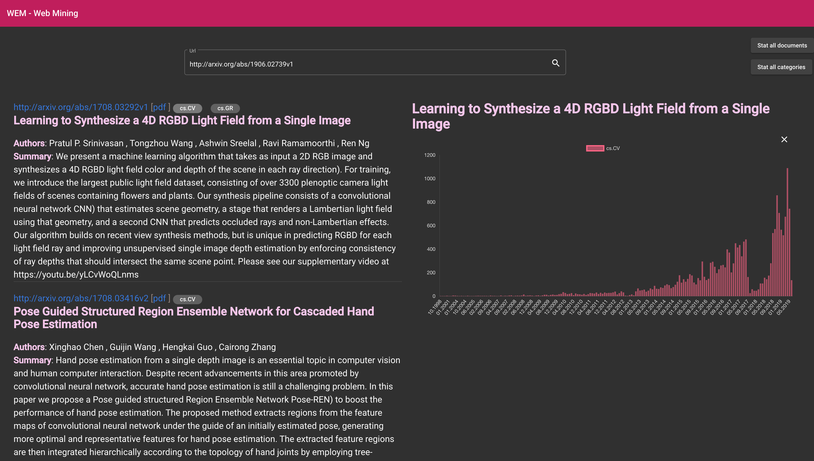
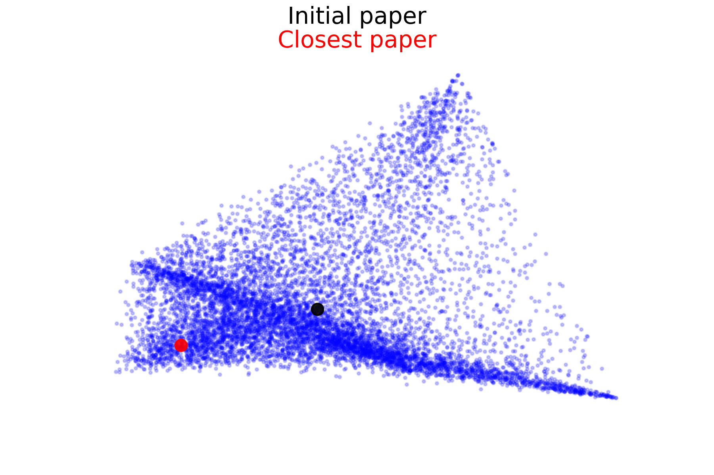
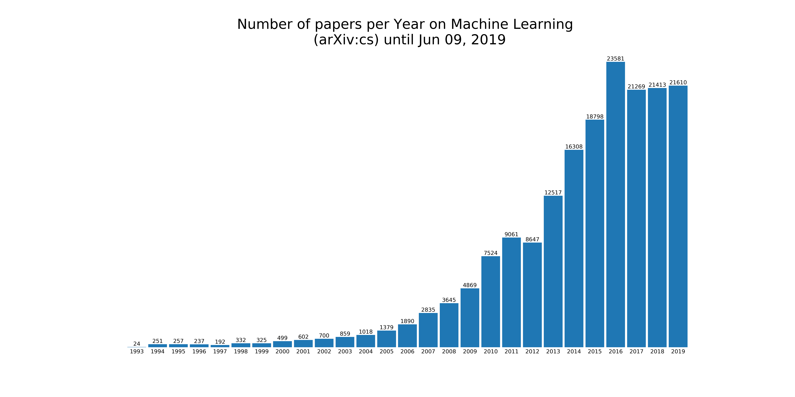

# mse.wem.project
Web Mining at Master of Engineering (MSE), Switzerland

Auteurs: Romain Claret, Dorian Magnin & Damien Rochat

## Contexte et objectifs du projet

Le site arXiv.org permet d’obtenir des articles numériques en accès libre. Le site a été créé en 1991 dans le but d'échanger des preprints dans le domaine de la physique. Il est aujourd'hui géré par la Cornell University Library et il héberge des preprints, postprints et des articles du domaine public.

Il y a aujourd'hui **1'519'310 soumissions** dans des champs divers et variés tels que la physique, les mathématiques, l'informatique, la biologie, la finance, les statistiques ou encore l'économie.

Actuellement, arXiv.org propose un champ de recherche avec quelques filtres, ce qu'il n'est pas idéal pour découvrir des articles qui pourraient potentiellement nous intéresser. Le but de ce projet est donc de développer une petite interface qui va permettre de recevoir des recommandations d'articles, en fonction d'un article donné.

Les objectifs sont :

1. Récupérer et stocker les données de arXiv.org
2. Mettre en place un système de recommandation
3. Classer les articles recommandés
4. Développer une interface simple pour utiliser le système de recommandation
5. Afficher des statistiques sur les données depuis l'interface
6. Exécuter les différents services dans une infrastructure Docker

## Données (sources, quantité, pré-traitement, description)

arXiv.org met à disposition une API gratuite permettant de récupérer les articles au format XML. Celle-ci possède les mêmes fonctions que le moteur de recherche du site.

Ci-dessous, la description des différents champs retournés par l'API.

| Champs               | Description                                             |
| -------------------- | ------------------------------------------------------- |
| **title**            | Titre de l'article                                      |
| **id**               | Url de l'article, au format http://arxiv.org/abs/id     |
| published            | Date de première soumission de l'article (version 1)    |
| updated              | Date de soumission de la versiona actuelle de l'article |
| **summary**          | Résumé de l'article                                     |
| **author**           | Nom des différents auteurs de l'article                 |
| **link**             | Liens vers l'article (PDF)                              |
| **category**         | Catégories de l'article (catégories arXiv, ACM et MSC)  |
| **primary_category** | Catégorie arXiv principale de l'article                 |
| affiliation          | Affiliation de l'auteur (université, société, etc.)     |
| journal_ref          | Référence de journal si existant                        |
| doi                  | URL DOI si existant                                     |

Les champs en gras sont ceux qui sont utilisés pour ce projet.

Seuls les articles de la catégorie **Computer Sciences **sont récupérés. Cela représente un total de **180'644 publications**, **194 catégories** et **205'782 auteurs**.

## Planification, répartition du travail
Voici les différentes milestones du projet :

- Créer le crawler pour l'API arXiv.org
- Stocker les données dans un fichier CSV de référence
- Mettre en place le classement par similarité de Neo4j
- Mettre en place le classement avec le modèle LDA
- Mettre en place l'interface graphique

Ci-dessous, la liste des différentes tâches réalisées par chacun des membres du groupe. 

Damien :
- Crawling de l'API
- Création du fichier CSV de référence
- Mise en place et utilisation de Neo4j
- Implementation back-end Neo4J

Dorian :
- Mise en place de l'interface graphique 
- Back-end pour gérer les API REST
- Docker pour le front et le back-end

Romain :
- Crawling de l'API
- Génération des statistiques pour les catégories et articles
- Mise en place et utilisation de LDA
- Implementation back-end LDA
- Algorithme de ranking combinant LDA et Neo4J

## Fonctionnalités / Cas d’utilisation
- La fonctionnalité principale de l'application est de pouvoir renseigner l'URL d'un article arXiv.org (par exemple http://arxiv.org/abs/1906.02739v1) afin de recevoir en retour une liste d'articles recommandés. Ceci sera fait au travers d'une interface Web simpliste.
- L'interface permettra également d'obtenir quelques statistiques sous forme de graphiques, liés aux articles remontés.
    - Il est possible d'afficher un graphique montrant l'évolution de la publication des articles aux files des mois et années
    - Il est possible d'afficher un graphique montrant une distribution de la totalité des articles publiés par catégories
    - Il est possible d'afficher un graphique lié à l'évolution d'une catégorie au fil des mois et année

## Techniques, algorithmes et outils

### Algorithme de recommandation
Le système de recommandation de fait en 3 étapes et utilise une combinaison de 2 méthodes de récupération d'articles similaires.

1) Le modèle LDA retourne les articles les plus similaires en termes d'abstract.
2) La base de données Neo4j calcule les similarités entre ses articles et celui recherché en comparant les liens entre auteurs et catégories.
3) Un ranking est fait pour pondérer les articles
    - Vers le haut si l'article est simultanément présent dans les deux résultats
    - Vers le bas si l'article n’est pas simultanément présent dans les deux résultats

### Modèle LDA
LDA est un algorithme permettant, basé sur des topiques précalculés de trouver des similarités entre des documents.

Dans notre cas nous avons utilisé une classification basée sur 10 topiques/features, pour déterminer la similarité entre les articles.

De plus, nous classifions également les articles similaires trouvés entre eux selon les features utilisés par l'article d'origine et finalement un dernier Storting basés sur le produit scalaire entre les articles similaires et l'article d'origine.

Nous avons entraîné plusieurs modèles et avons gardé le modèle avec les spécifications suivantes: (à noter que le temps de calcule est mesurable en jours... mêmes pour notre "petit" dataset)
- topiques: 10
- passes: 10
- remove tokens with a document frequency lower than 2 recurrences
- remove tokens with a document frequency higher than 10%
- remove English stop words
- using tokens with at least 3 letters

### Neo4j
Neo4j est une base de données permettant de stocker des données de types graphe. Les publications, les auteurs et les catégories sont stockés comme des sommets. Les liens sont ensuite ajoutés entre chacun d'eux, selon les données reçues.

Les liens permettent ensuite de comparer les relations communes entre plusieurs noeuds, avec un algorithme de similarité. C'est l'algorithme de Jaccard qui a été utilisé dans ce cas. Celui-ci va comparer les sommets voisins de plusieurs sommets donnés et produire un résultat représentant la similarité, cette valeur est comprise dans l'intervalle $[0,1]$.

En résumé, plus deux publications auront d'auteurs et de catégories en commun, plus leur similarité sera élevée.

Dans le cadre de ce projet, seules 50'000 publications ont été enregistrées dans Neo4j. En effet, plus d'entrées provoquaient des problèmes de mémoire liés à la machine virtuelle Java. Il a été possible d'ajouter toutes les données en splittant les datasets et en les enregistrant une partie après l'autre. Mais la quantité de données a rendu impossible le calcul des similarités en live. De plus, un précalcul n'était pas possible, car cela provoquait également des problèmes de mémoire.

### Graphiques et Statistiques
Dans le but de fournir des statistiques en lien avec les articles, les catégories, et les dates de publications, nous avons généré un fichier JSON à l'aide pandas dataframe.

### Interface utilisateur
Pour la création du site web, nous avons utilisé différentes technologies qui sont suivantes :

- Flask est un Framework pour le web développé en Python et qui permet de mettre en place une gestion des API REST.
- Angular qui est un Framework développé en TypeScript et qui permet de réaliser une interface Web. 
  Ces différents composants ont été utilisés avec Angular : 
  - ng-chartjs permet de réaliser les graphiques.
  - Material qui fournit des composants de conception matérielle pour Angular.
  - Bluma qui est un Framework CSS qui facilite la mise en place de la structure d’un page Web.

#### Infrastructure Docker
Docker a aussi été utilisé pour créer les trois serveurs dont nous avions besoin :

- Un serveur pour Neo4J
- Un serveur pour Flask (partie backend)
- Un serveur pour Angular (partie frontend)

Pour tester l’application avec Docker, il suffit de se rendre à la racine du projet (où se trouve le fichier `docker-compose.yml` et d'exécuter la commande suivante `docker-compose up` qui va créer les images nécessaires.

## Améliorations et prochaines étapes

### Pondération des relations dans Neo4j
Actuellement, le calcule de similarité entre deux sommets du graphe Neo4j donne la même importance aux auteurs et aux catégories. Une amélioration pourrait être de donner plus de poids à la catégorie principale, aux auteurs et moins de poids aux catégories secondaires.

### Pré-calcul des similarités entre les publications dans Neo4j
Neo4j permet de calculer la similarité entre tous les sommets, selon la même fonction qu'actuellement utilisée. Cependant, il s'agit d'une opération très importante. Prendre le temps de précalculer toutes les similarités entre les publications permettrait de gagner du temps lors des requêtes. Il faudra par contre prévoir de calculer les nouvelles similarités lors de la mise à jour du graphe (par exemple lors de l'ajout d'une nouvelle publication).

### Utilisation d'un plus gros dataset
Nous avons utilisé toute la catégorie Computer Science sur Arxiv, cependant il serait intéressant de voir les similarités entre des articles qui ne sont a priori pas en rapport, car dans des catégories distinctes.

### LDA avec plus de topiques et passes
Dû à des limitations liées au temps et à la nature des expérimentations, il serait à présent intéressant d'augmenter les features utilisés par LDA et augmenter le nombre de passes. 

### LDA avec plus de texte
En effet, nous utilisons actuellement que l'abstract comme moyen de comparaison. Il serait intéressant d'augmenter le texte de comparaison avec le contenu du PDF de chaque article.

### Meilleur algorithme de ranking
Notre alogirthme est actuellement très naïf, et il serait intéressant de continuer l'exploration de cet élément en combinant plus précisément les différentes options de Neo4j et possiblement d'ajouter un autre modèle LDA spécialisé dans un autre domaine.

## Conclusion

Le projet a été intéressant du début à la fin. Il nous a permis de mettre en pratique de crawling d'une API Web avec les problématiques de timeout, limitations de resources à 50k entrés et bannissement qui en découle, le stockage et le traitement d'une grande quantité de données.

Nous pourrions grandement améliorer les différents algorithmes mis en place, ainsi que la fusion de valeurs retournées par ceux-ci. Cependant, afin d'arriver à des résultats plus précis, nous devrions utiliser des machines distantes et plus conséquentes. En effet, il devient déjà difficile de traiter toutes ces données sur une même machine, notamment avec Neo4j dans un conteneur Docker.

Nous avons eu une grande utilité des Jupyter Notebooks qui nous ont permis de gagner beaucoup de temps lors de l'exploration des données, ainsi que durant l'élaboration des différents requêtes et algorithmes.
